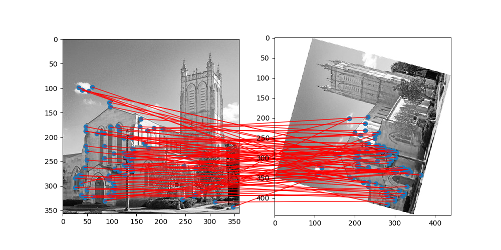

# SIFT - Scale-Invariant Feature Transform

In this project, local features of two images are detected from the [SIFT](https://en.wikipedia.org/wiki/Scale-invariant_feature_transform#cite_note-Lowe1999-1) algorithm. This implementation follows the well known [Anatomy of the SIFT Method](https://www.ipol.im/pub/art/2014/82/?utm_source=doi).

## _Requirements_
Works with Python 3.7.5 and requires:
- cv2
- matplotlib
- numpy
- scipy
- torch

## _Usage_
In the main function of pysift.py, you have to set the path of two images. Then, run ```python  pysift.py```, so that it will plot your two images with the corresponding keypoints.

## _Output_
With the given images, you will obtain the following figure:

